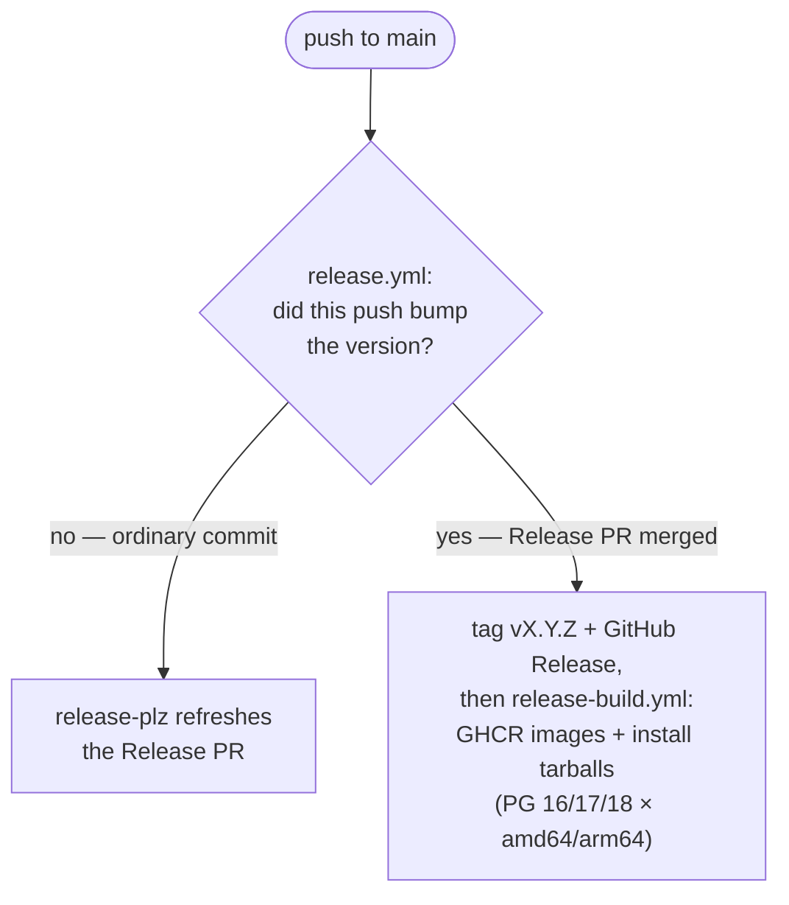

# Releasing proxquery

One gate: merge the Release PR. Everything after it is automatic.

This release is for the compiled extension. The [pure-SQL port](PURE_SQL.md) isn't versioned outside of the git history.

## Versioning

Commit messages follow [Conventional Commits](https://www.conventionalcommits.org/).
release-plz reads them to compute the next version and write `CHANGELOG.md`:

- `fix:` → patch · `feat:` → minor · `feat!:` / `BREAKING CHANGE:` → (pre-1.0) minor.
- Anything else (`chore:`, `docs:`, `ci:`, `refactor:` …) doesn't trigger a release on its own.

## Cutting a release

1. Commit to `main` with conventional-commit messages.
2. release-plz maintains a single **Release PR** ("chore: release v…") that bumps
   `Cargo.toml`/`Cargo.lock` and updates `CHANGELOG.md`. It rewrites this same PR
   on every push — it does **not** stack new ones.
3. When you're ready, review and merge the Release PR.
4. On merge, `release.yml` tags `v<x.y.z>` and creates the GitHub Release (with the
   changelog as notes), then `release-build.yml` builds the full
   **PG 16/17/18 × amd64/arm64** matrix once and publishes both artifact sets.

Each matrix leg compiles the Dockerfile once on a native runner, smoke-tests the
image (`packaging/smoke.sh` boots it and runs `CREATE EXTENSION`), pushes it, and
lifts the install tarball out of the same build — so a broken image never reaches
GHCR.

## Artifacts

**Docker images** (multi-arch manifests on GHCR):

- `ghcr.io/elemdiscovery/proxquery:<version>-pg<NN>` — immutable, per release
- `ghcr.io/elemdiscovery/proxquery:pg<NN>` — rolling latest for that major
- `ghcr.io/elemdiscovery/proxquery:latest` — tracks pg17

**Install tarballs** attached to the GitHub Release, one per PG major × arch, each
relocatable: `proxquery.so` + `proxquery.control` + `proxquery--<version>.sql` +
`install.sh`. `install.sh` copies them into the target server's `pkglibdir` /
`sharedir/extension` (via `pg_config`). Tarballs carry a `.sha256` and a keyless
Sigstore build-provenance attestation — verify a download with
`gh attestation verify <tarball> --repo elemdiscovery/proxquery`.

## Rebuilding a release

To rebuild or re-push a published release's artifacts, run **release-build.yml**
manually (Actions → "release-build" → Run workflow) with the release tag selected
as the workflow ref. The Release must already exist.

## Portability caveat

The Dockerfile builds with `glibc` 2.36, so that's the minimum version required by
the binary tarballs as well.
