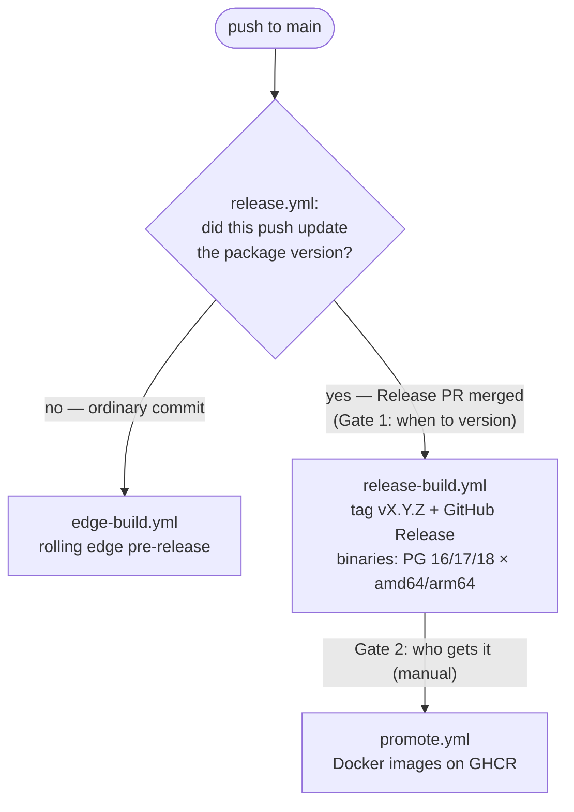

# Releasing proxquery

Two deliberate gates, plus a continuous pre-release channel in between.

This release is for the compiled extension. The [pure-SQL port](PURE_SQL.md) isn't versioned in a release outside of the git history.

## Versioning

Commit messages follow [Conventional Commits](https://www.conventionalcommits.org/).
release-plz reads them to compute the next version and write `CHANGELOG.md`:

- `fix:` → patch · `feat:` → minor · `feat!:` / `BREAKING CHANGE:` → (pre-1.0) minor.
- Anything else (`chore:`, `docs:`, `ci:`, `refactor:` …) doesn't trigger a release on its own.

## Gate 1 — numbered release

1. Commit to `main` with conventional-commit messages.
2. release-plz maintains a single **Release PR** ("chore: release v…") that bumps
   `Cargo.toml`/`Cargo.lock` and updates `CHANGELOG.md`. It rewrites this same PR
   on every push — it does **not** stack new ones.
3. When you're ready to release, review and merge the Release PR — the `edge` build is skipped on these commits.
4. On merge, `release.yml` tags `v<x.y.z>`, creates the GitHub Release (with the
   changelog as notes), and — in the same run — `release-build.yml` builds the
   full **PG 16/17/18 × amd64/arm64** matrix and attaches the tarballs +
   `.sha256` files to the Release.

Each tarball is relocatable: `proxquery.so` + `proxquery.control` +
`proxquery--<version>.sql` + `install.sh`. `install.sh` copies them into the
target server's `pkglibdir` / `sharedir/extension` (via `pg_config`).

## `edge` builds

Every non-release push to `main` publishes a single rolling `edge` pre-release
(PG 17, amd64 + arm64), versioned `…-dev.<n>.g<sha>`. It's for testing `main`:
**fresh installs only, no `ALTER EXTENSION … UPDATE` path, not for production.**

## Gate 2 — promote to GHCR

Manual, on an already-published release, via the **promote** workflow
(Actions → "promote" → Run workflow → enter the tag, e.g. `v0.2.0`). Each image
is booted and `CREATE EXTENSION`-checked (`packaging/smoke.sh`) before it's
pushed, so a broken image never reaches GHCR. It pushes multi-arch images:

- `ghcr.io/elemdiscovery/proxquery:<version>-pg<NN>` — immutable, per release
- `ghcr.io/elemdiscovery/proxquery:pg<NN>` — rolling latest for that major
- `ghcr.io/elemdiscovery/proxquery:latest` — tracks pg17

## Portability caveat

The Dockerfile builds with `glibc` 2.36 so that's the minimum version required on our binary release as well.
